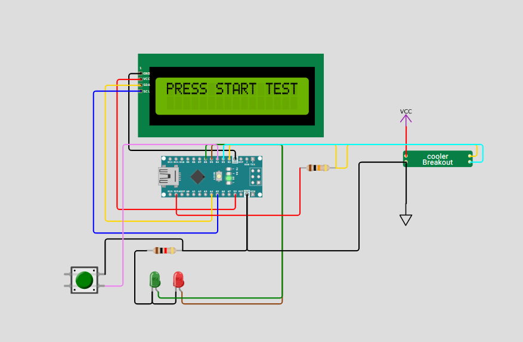
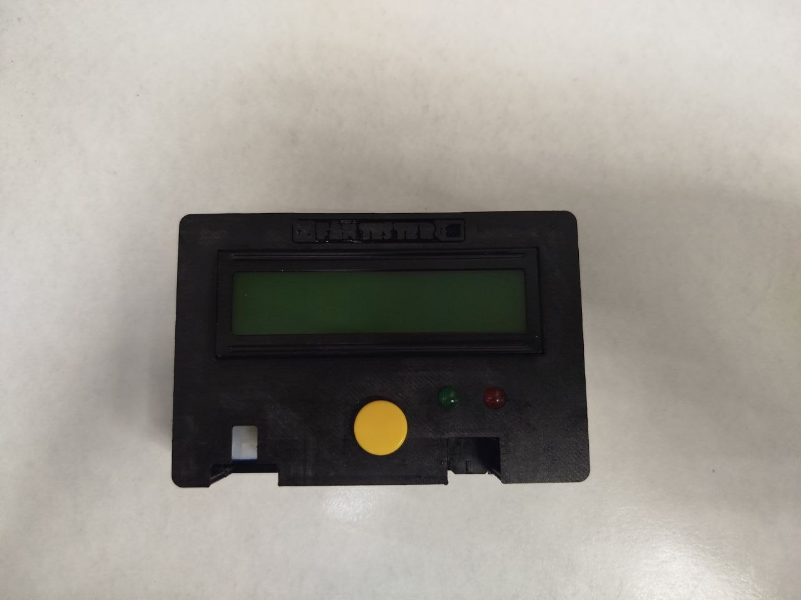
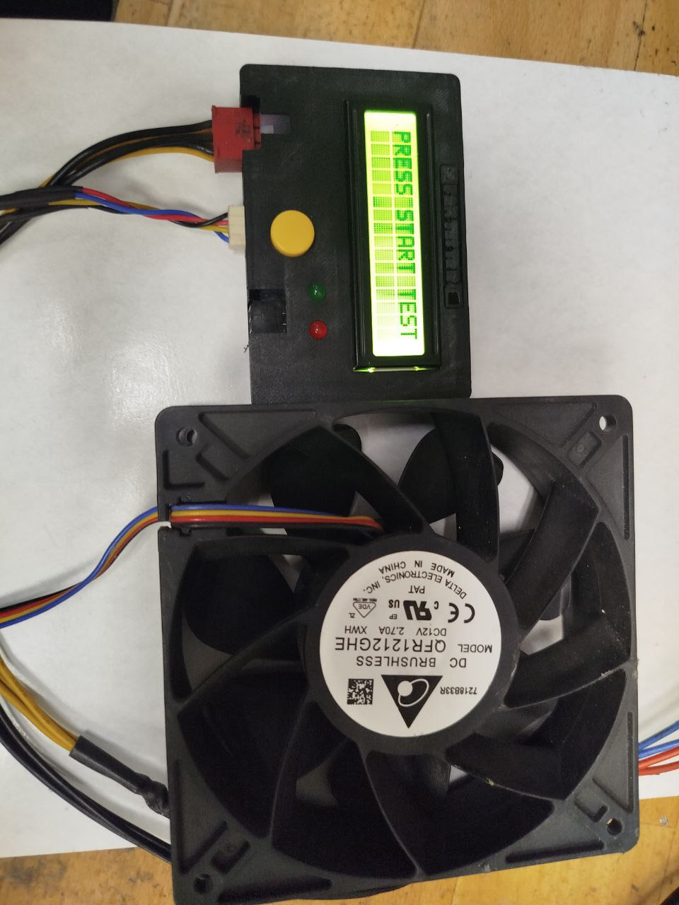
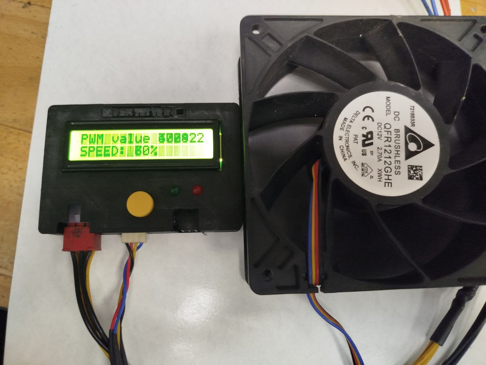
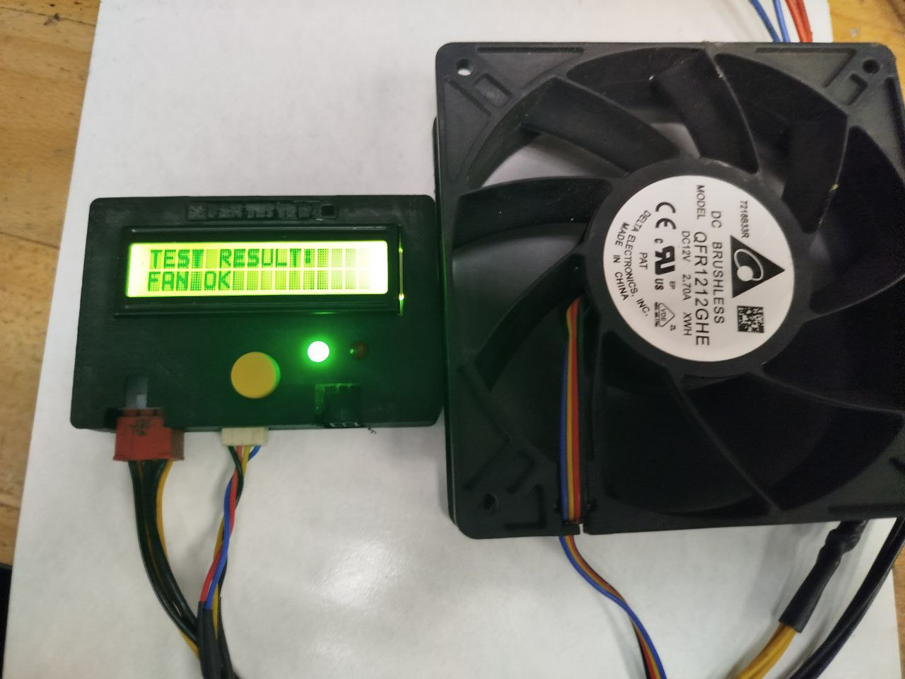
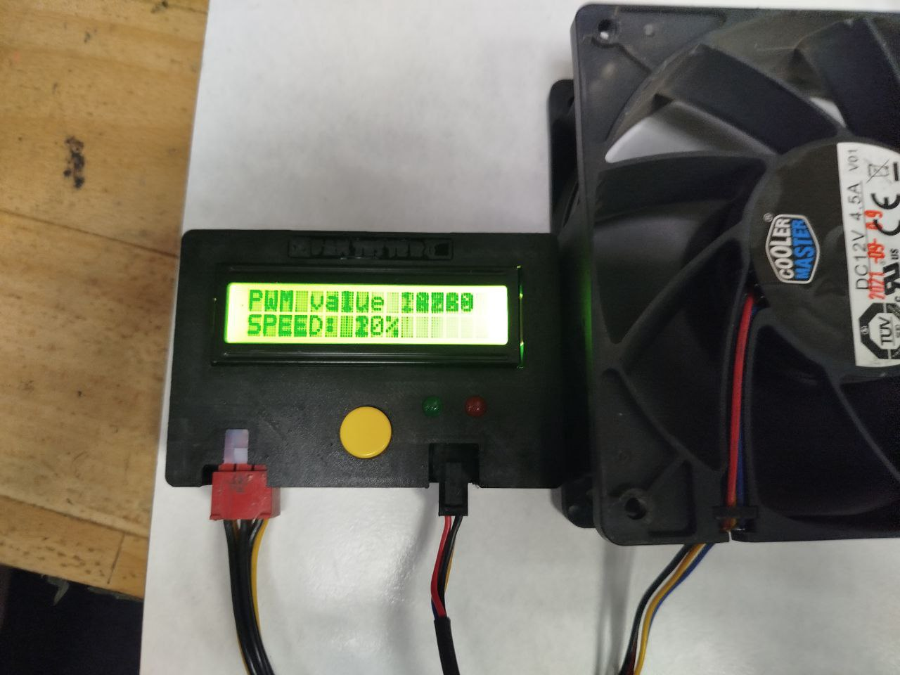
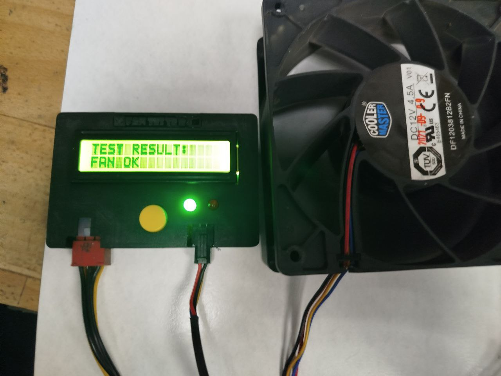
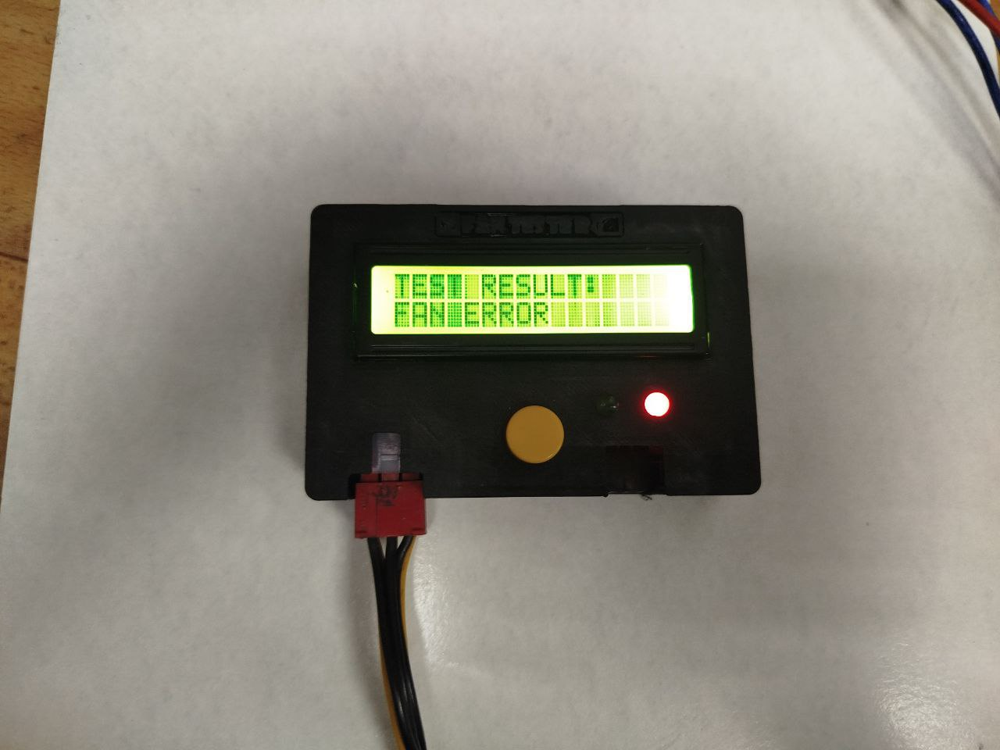

# Тестер кулеров для устройств Canaan Avalon и Bitmain Antminer

## Описание
Данный тестер предназначен для быстрой проверки кулеров на наличие сигналов PWM вход/выход. Он позволяет за 3 секунды определить, исправен ли кулер. Тестер подключается к блоку питания Bitmain с напряжением 12-14 вольт.

## Особенности
- **Подключение кулеров**: Тестер имеет два разъёма для подключения кулеров — Avalon и Antminer. 
- **Ограничение**: Не допускается тестирование двух кулеров одновременно.
- **Процесс тестирования**: 
  - При подключении кулера и нажатии на кнопку теста, кулер разгоняется от 0% до 100% за 3 секунды.
  - По завершении теста отображается результат, и ШИМ возвращается обратно в 0%.
- **Индикаторы**: 
  - Зелёный светодиод — исправный кулер.
  - Красный светодиод — неисправный кулер.
- **Дисплей**: Тестер оснащён LCD дисплеем 1602, который отображает процесс тестирования и результат.

## Комплектация
В состав тестера входит:
- Arduino Nano.
- LCD 1602 i2C.
- Разъём 6pin PCI-E 4.2мм угловой (Для питания системы)
- Разъём питания ATX 4 pin Female угловой (Для кульков Canaan)
- Разъём MOLEX KF2510-4P Male угловой (Для кульков Antminer)
- Кнопка B3F-4055 12x12x7.3 мм с колпачком (Желтым)
- Провода соеденительные
- Светодиод 5mm 3V3 Зелёный
- Светодиод 5mm 3V3 Красный
- Резистор 10K для сигнала PWM
- Резистор 1K для светододов
- Провода соеденительные
- Макетная плата

## Эмуляция
Вы можете протестировать работу тестера в эмуляторе по следующей ссылке: [Эмуляция тестера](https://wokwi.com/projects/436005347190425601).

## Фото

## Автор
Антон Виноградов  
Telegram: [@vinantole](https://t.me/vinantole)
